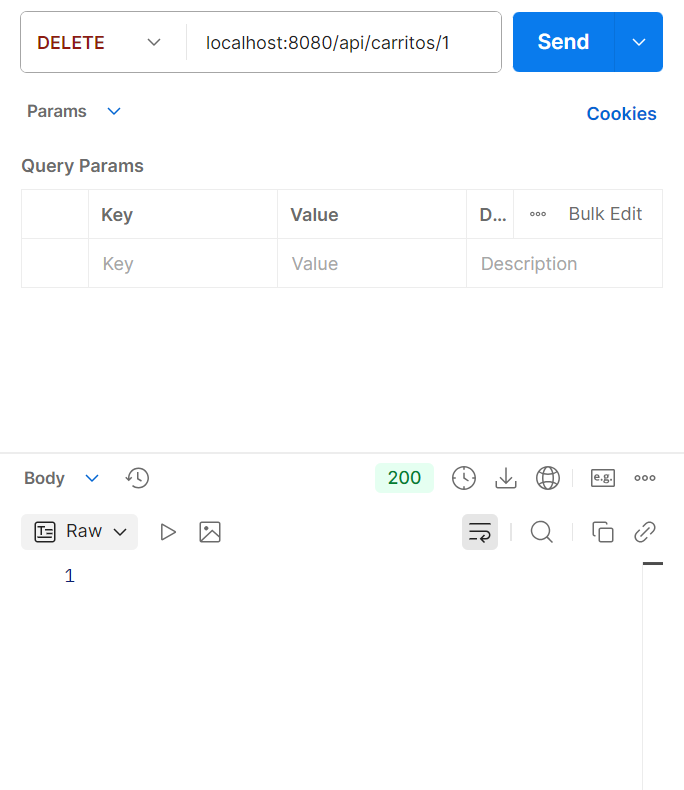

# Práctica 2 - API REST
### Programación de Aplicaciones Telemáticas - 3ºB GITT+BA
#### José Manuel Fernández Freige

En este documento se expone la memoria de la práctica 2 de la asignatura detallando los pasos seguidos e indicando un resumen de las funcionalidades implementadas. 

El objetivo de la práctica consiste en la creación de un servicio Web REST siguiendo el estilo **request/response** sobre el protocolo **HTTP**. Este servicio deberá implementar las funcionalidades del patrón **CRUD** (Create, Read, Upadte, Delete) sobre un recurso llamado **"Carrito"** modelando un e-commerce básico.

Para la creación de API REST se seguirá el patrón **Modelo - Vista - Controlador** visto en clase implementando un modelo básico mediante un objeto de tipo "Carrito" y un **Controlador REST** capaz de recibir, gestionar y responder peticiones del cliente. 

Los endpoints a implementar se resumen en la siguiente tabla:

| Método | Ruta | Cuerpo (Body) | Descripción | Posibles Respuestas |
| :--- | :--- | :--- | :--- | :--- |
| `GET` | `/api/carritos` | N/A | Obtener lista de los carritos | `200 OK` |
| `POST` | `/api/carritos` | JSON Carrito | Crear y añadir carritos a la lista | `201 Created`, `400 Bad Request` |
| `GET` | `/api/carritos/{idCarrito}` | N/A | Obtener el carrito con ID: "idCarrito" | `200 OK`, `404 Not Found` |
| `DELETE` | `/api/carritos/{idCarrito}` | N/A | Borrar el carrito con ID: "idCarrito" | `200 OK` (o `204`), `404 Not Found` |
| `PUT` | `/api/carritos/{idCarrito}` | JSON Carrito | Modificar el carrito con ID: "idCarrito" | `200 OK`, `400 Bad Request`, `404 Not Found` |

### Inicialización del Proyecto con Spring Boot
Para comenzar con la creación de API REST se ha hecho uso de **Spring Boot Initializer** tal y como se ha hecho en los ejemplos de clase. En la generación del proyecto de Spring, se ha seleccionado Maven como el gestor de dependencias, la versión 4.0.2 de Spring y la versión Java 21 para el lenguaje de programación. 
Una vez se ha generado el proyecto, se define como un repositorio de Git en el que se crea una rama principal para ir subiendo los cambios realizados. 

### Creación del Modelo 
Para representar la información de los carritos en el sistema, se ha definido la clase Carrito dentro del paquete modelo. Esta clase actúa como un objeto simple de transferencia de datos con las propiedades fundamentales del recurso.
Como simplificación a la práctica indicada en el enunciado: **cada carrito solo puede contener un único producto** (no existe lista de líneas).

Los atributos definidos son:
* **idCarrito** (Identificador único del carrito).

* **idArticulo** (Identificador del artículo contenido).

* **descripcion** (Nombre o detalle del artículo).

* **unidades** (Cantidad de artículos).

* **precioFinal** (Precio total).

Además, se han generado el constructor completo y los métodos Getters y Setters para permitir el acceso y modificación de estos datos desde el controlador.

### Creación del Controlador y los Endpoints
La lógica de negocio y la gestión de las peticiones HTTP se han centralizado en la clase CarritoControlador.

Anotación Principal: Se ha utilizado la anotación @RestController, lo que indica a Spring que esta clase manejará solicitudes web y que las respuestas se serializarán directamente en el cuerpo de la respuesta (generalmente en formato JSON).

Persistencia de Datos: Dado que no se utiliza una base de datos externa en esta práctica, se ha simulado la persistencia utilizando una estructura de datos en memoria Map<Integer, Carrito> (específicamente un HashMap).

**Mapeo de Peticiones:**

Se han utilizado las anotaciones @GetMapping, @PostMapping, @PutMapping y @DeleteMapping para vincular las rutas URL con los métodos Java correspondientes.

Para la lectura de datos enviados por el cliente, se utiliza @RequestBody (para convertir el JSON recibido en un objeto Carrito) y @PathVariable (para capturar el idCarrito directamente de la URL).

En el caso de la creación, se ha especificado el código de estado HTTP correcto mediante @ResponseStatus(HttpStatus.CREATED).

### Pruebas realizadas
Para verificar el correcto funcionamiento de la API REST, se han realizado pruebas funcionales simulando un cliente HTTP (utilizando herramientas como Postman o cURL). El flujo de pruebas ha consistido en:

* **POST:** Enviar una petición para crear un nuevo carrito con un JSON válido. Se verifica que devuelve el objeto creado y el código 201.

* **GET (Lista):** Solicitar la lista completa para confirmar que el carrito creado anteriormente aparece en la respuesta.

* **PUT:** Modificar el número de unidades o descripción del carrito existente mediante su ID.

* **GET (Individual):** Consultar el carrito por su ID específico para validar que los cambios del PUT se han guardado.

* **DELETE:** Eliminar el carrito y verificar posteriormente que ya no se encuentra en la lista de recursos.
 
